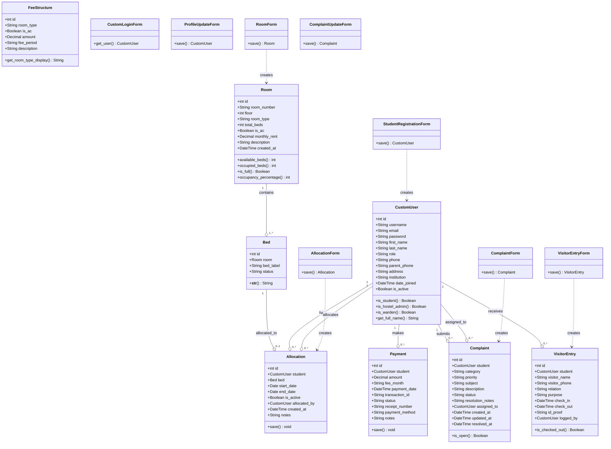

# Class Diagram
## Hostel Room Allocation & Complaint Management System

## Module-wise Class Organization

### accounts (Authentication Module)
- `CustomUser` — extends Django AbstractUser
- `StudentRegistrationForm`, `CustomLoginForm`, `ProfileUpdateForm`

### rooms (Room & Allocation Module)
- `Room`, `Bed`, `Allocation`
- `RoomForm`, `BedForm`, `AllocationForm`

### fees (Fee Management Module)
- `FeeStructure`, `Payment`

### complaints (Complaint Module)
- `Complaint`
- `ComplaintForm`, `ComplaintUpdateForm`

### visitors (Visitor Log Module)
- `VisitorEntry`
- `VisitorEntryForm`

### dashboard (Dashboard Module)
- No models (uses aggregation across all apps)
