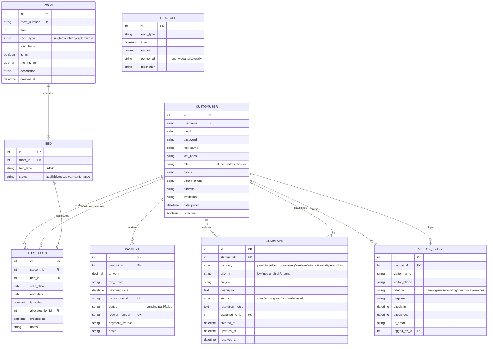

# ER Diagram
## Hostel Room Allocation & Complaint Management System

## Relationships Summary

| Relationship | Cardinality | Description |
|---|---|---|
| Room → Bed | 1 : N | Each room contains one or more beds |
| Bed → Allocation | 1 : 0..1 (active) | Each bed can have at most one active allocation |
| Student → Allocation | 1 : N | A student can have multiple allocations over time |
| Student → Payment | 1 : N | A student can make multiple payments |
| Student → Complaint | 1 : N | A student can submit multiple complaints |
| Student → VisitorEntry | 1 : N | A student can have multiple visitors |
| Admin → Allocation | 1 : N | An admin allocates beds |
| Warden → Complaint | 1 : N | A warden can be assigned to multiple complaints |
